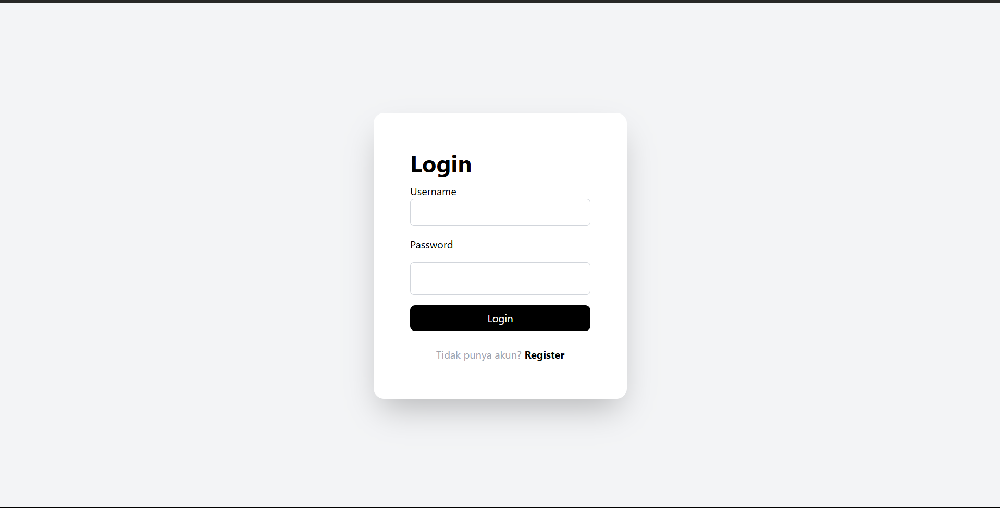
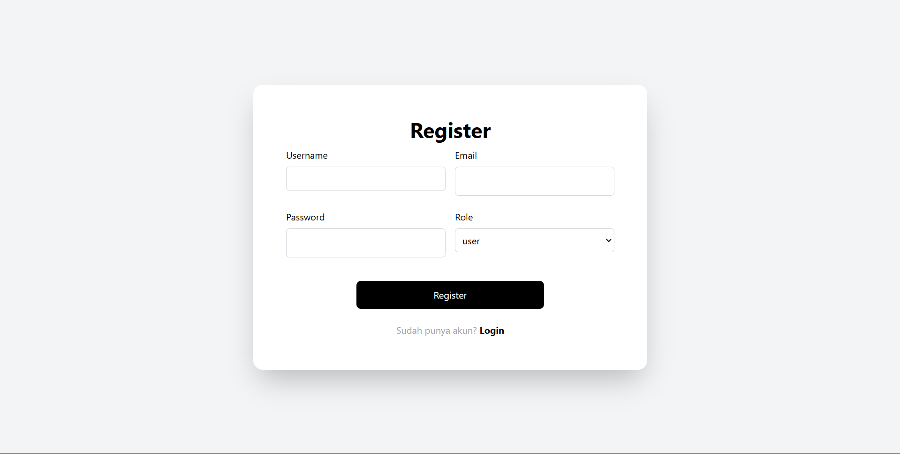
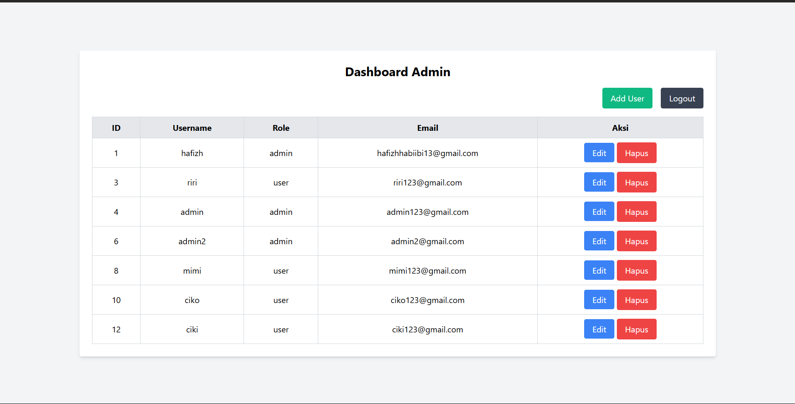
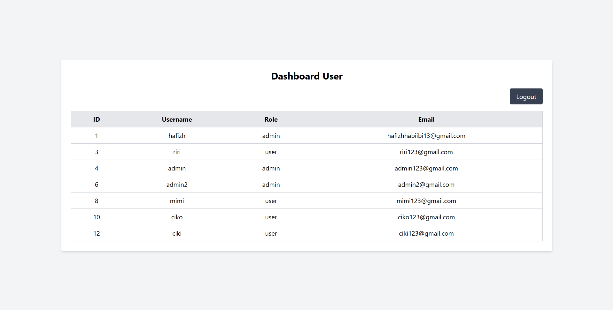
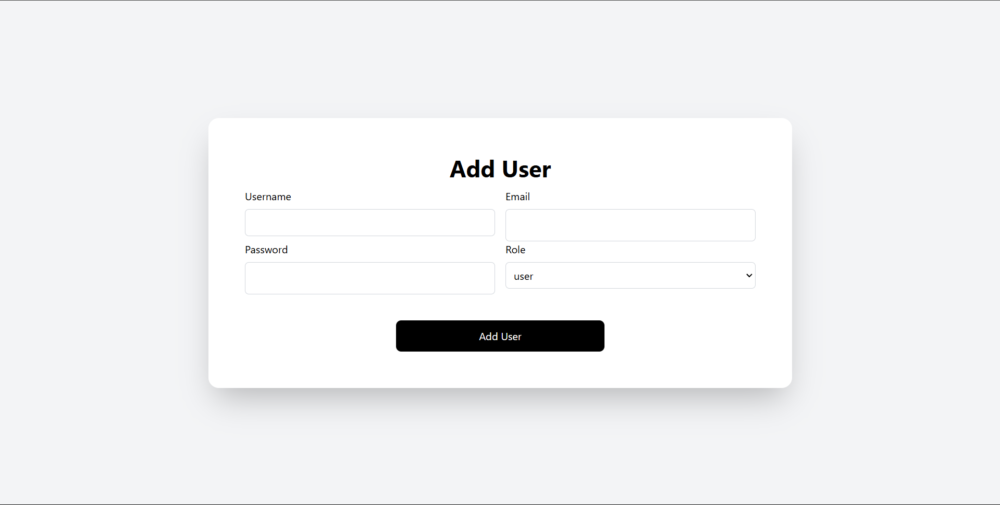
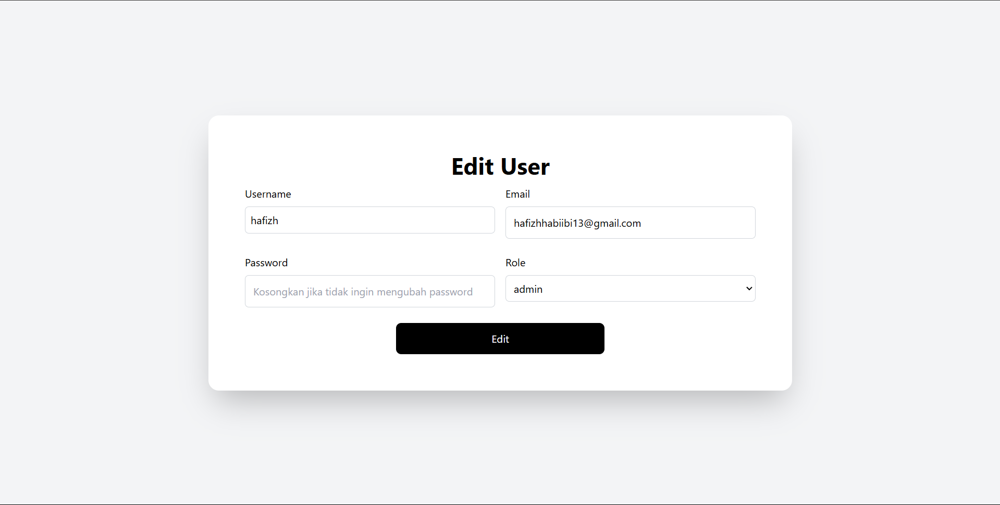

# Tugas Besar PWP

Nama    : Hafizh Habiibi Lubis

NPM     : 5230411296

Prodi   : Informatika


## Instalasi dan Running

Clone projek

```bash
  git clone https://github.com/HafizhHabiibi/project-kuliah-pwp.git
```

Install virtual env dan aktivasi

```bash
  python -m venv env
  #bash source env/bin/activate  #Windows: env\Scripts\activate
```

buat file .env yang berisi

```bash
  FLASK_ENV=development
  FLASK_APP=app
  DATABASE_URI=mysql+pymysql://root:@localhost:3306/pwptgsbesar
```

Install dependencies

```bash
  pip install -r requirements.txt
```

Install dependencies node.js dengan npm

```bash
  npm install
```

Migrasi database

```bash
  flask db init
  flask db migrate -m "Initial migration."
  flask db upgrade
```

Jalankan aplikasi

```bash
  python -m flask run
  atau
  python app.py
```


## PREVILEGE

- Pengguna dengan role "Admin" dapat mengakses halaman utama dashboard admin, add user, edit, delete, dan logout.
- akun admin : username = admin, password = admin123
- Pengguna dengan role "User" hanya dapat mengakses halaman utama dashboard user dan logout.


## Preview

- Halaman Login

    

- Halaman Register

    

- Halaman Dashboard Admin
    

- Halaman Dashboard User

    

- Halaman Add User

    

- Halaman Edit User

    